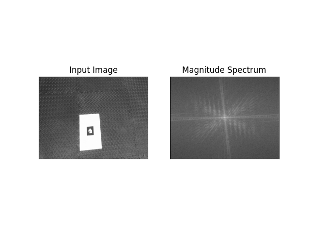
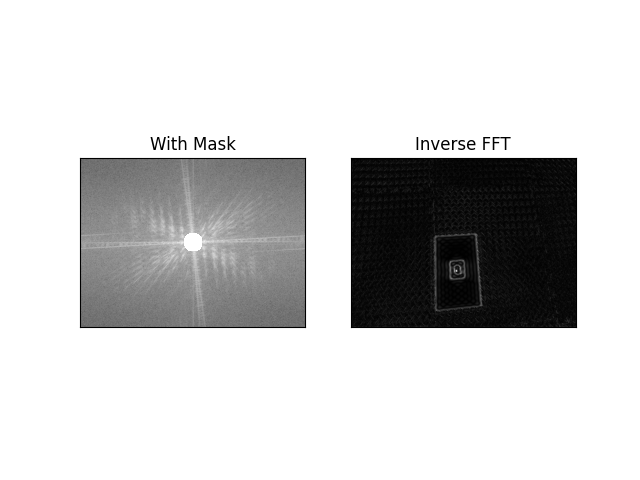
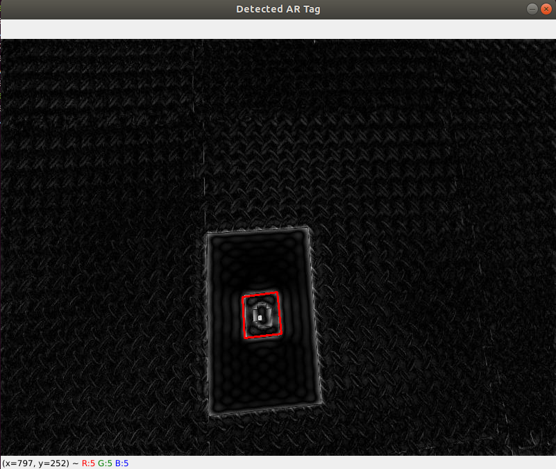

# AR-Homography
AR Tag Detection, Decoding, Tracking, and Superimposing image and cube on the tag

## Description
This project inolves detection of AR TAG, decoding, tracking and placing an image over the top of the tag.

## Folder contents:
	1) myUtils.py: file having all major functionlity - warping, tag decoding, homography, calculating projection matrix and drawing cube
	2) part1a.py: For detecting AR Tag using FFT and IFFT
	3) part1b.py: For decoding the AR Tag
	4) part2a.py: For superimposing turtle on top of AR Tag
	5) part2b.py: For placing a 3D cube on top of AR Tag
	6) Four video files
	7) test.png: Turtle image
	8) AR_REF.png: Reference tag to be used in 1b
	9) frame.jpg: One frame from Tag1.mp4 to be used in 1a
	10) Readme.md: this file
	11) ENPM673_Project1_Report.pdf: Project report

## Steps to run:
	1) Please make sure all the above video and image files are in the same location as python files
	2) Run as:
		python3 part1a.py
		python3 part1b.py
		python3 part2a.py -> Tag video to be selected during runtime
		python3 part2b.py -> Tag video to be selected during runtime

## Outputs from run:

### AR TAG Detection using FFT and IFFT
### Input image and magnitude spectrum

### Mask and Inverse FFT

### Detected TAG

### Superimposing image over the tag

### Superimposing 3D cube over the tag

 
## Link to output videos
	https://drive.google.com/drive/folders/1WKKZuLhzhrkDBE0SDUwo-rd6GhYtW3f7?usp=sharing
